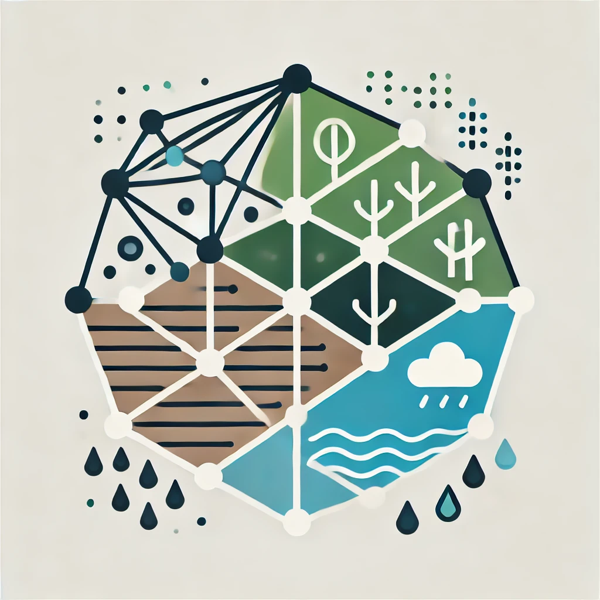

<table>
  <tr>
    <td>
      
    </td>
    <td>
      <strong>torchHydroNodes</strong>: A Python package for training and testing hybrid hydrological models combining conceptual/physics-based models and neural networks.
    </td>
  </tr>
</table>

---

---
**WORK IN PROGRESS / FRAMEWORK UNDER DEVELOPMENT**

`torchHydroNodes` is an evolving Python library designed for developing hybrid hydrological models that integrate conceptual/physics-based models with neural networks. Inspired by [Höge et al., 2022](https://hess.copernicus.org/articles/26/5085/2022/), this framework builds upon the original [HydroNODE](https://github.com/marv-in/HydroNODE) implementation in Julia using the [SciML packages](https://sciml.ai/).

The library is designed to be modular and user-friendly, enabling users to implement, adapt, and test their own hybrid models with ease. Features include:

- Support for loading and using datasets in a customizable way.
- Methods for parameter estimation.
- Integration of various conceptual models.
- Compatibility with multiple neural network architectures (e.g., MLP, LSTM, etc.).
- Flexible hybrid coupling strategies.
- Options for training single- and multi-basin models.
- A variety of metrics for model training and evaluation.
- Access to multiple ODE solvers leveraging [SciPy](https://docs.scipy.org/doc/scipy/reference/generated/scipy.integrate.solve_ivp.html) and [torchdiffeq](https://github.com/rtqichen/torchdiffeq).

The source code structure, data handling, and metrics implementation are inspired by the [NeuralHydrology library](https://github.com/neuralhydrology/neuralhydrology).

Comprehensive documentation, including a getting started guide, configuration parameter details, simulation setup instructions, model descriptions, use cases, and tutorials, is available at: [torchhydronodes.readthedocs.io](https://torchhydronodes.readthedocs.io).

---

## Key Features

- **Modular Design**: A flexible framework to implement, adapt, and extend hybrid hydrological models for various use cases.
- **Neural Network Integration**: Native support for MLP, LSTM, and other neural architectures.
- **Dataset Handling**: Tools to load and preprocess multiple hydrological datasets with minimal setup.
- **Hybrid Coupling**: Seamless integration of conceptual models with neural networks for improved accuracy and interpretability.
- **ODE Solvers**: Access to SciPy's and Torchdiffeq’s ODE solvers for efficient numerical integration.
- **Metrics**: Comprehensive metrics tailored for hydrological simulations, enabling detailed performance evaluations.

---
## License

**torchHydroNodes** is developed by the Numerical Simulation Research Lab at the Department of Computer Science, University of Saskatchewan. It is distributed under the BSD 3-Clause License. Please see the LICENSE file for specific details.

<!-- ## Data Handling

- **Data Download**: Instructions for downloading datasets compatible with `torchHydroNodes`.
- **Location & Configuration**: Guidelines on organizing and configuring data files to work seamlessly with the framework.
- **Custom Datasets**: Options to extend the framework to support new datasets. -->

---

---
Feel free to [contribute](https://torchhydronodes.readthedocs.io/en/latest/contributing.html), explore the [documentation](https://torchhydronodes.readthedocs.io), or join the discussion to help improve and expand **torchHydroNodes**!

